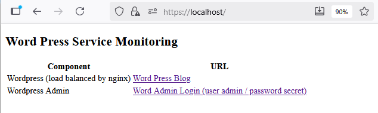

[Main Menu](../README.md) | [Session 2](../session2/README.md) | [Exercise-2-2-service-monitoring](../session1/Exercise-2-2-service-monitoring1.md)

# Exercise Service Monitoring

## service 3 tier network

Often sites are made scalable and more resilient through load-balancing a number of servers. 
In this example we have installed three wordpress servers behind an NGINX load balancer.

All the servers share the same MariaDB database which also maintains the user session data across the servers.


You can see the wordpress configuration if you look at the [docker-compose.yml](../session2/minimal-minion-activemq/docker-compose.yaml) file.
This contains a section for the OpenNMS containers, a section for three netsnmp containers (for a separate set of exercises) and at the bottom a section for the Wordpress containers.

You will see three Wordpress containers; wordpress1, wordpress2  and wordpress3. 
These all share the same data volume `wp_data` so that they are effectively clones of each other.

You will also see a wordpress-cli container. 
This container waits for 20 seconds after the project starts to allow the database and the other containers to start before initialising the word press containers, giving them their admin username and password and an initial front page name for the site using the command:

```
      /bin/sh -c '
      sleep 20;
      wp core install --path="/var/www/html/wordpress" --url="https://localhost/wordpress" --title="Local Wordpress By Docker" --admin_user=admin --admin_password=secret --admin_email=foo@bar.com
      '
```
After this initialisation step, this container exits.
Without wordpress-cli, you would have to manually configure the Wordpress instance on first start.

The nginx configuration is held in [wp-load-balencer-with-ssl.conf](..\session2\minimal-minion-activemq\container-fs\nginx\conf.d\wp-load-balencer-with-ssl.conf).
This sets up https termination and the round robin request forwarding to the three Wordpress servers.

## running the example

```
cd minimal-minion-activemq
docker compose up -d

[+] Running 21/21
 ✔ Network minimal-minion-activemq_N001               Created
 ✔ Network minimal-minion-activemq_N000               Created
 ✔ Volume "minimal-minion-activemq_wp_data"           Created
 ✔ Volume "minimal-minion-activemq_db_data"           Created
 ✔ Volume "minimal-minion-activemq_data-opennms"      Created
 ✔ Volume "minimal-minion-activemq_data-opennms-cfg"  Created
 ✔ Volume "minimal-minion-activemq_data-postgres"     Created

OpenNMS containers
 ✔ Container database                                 Started
 ✔ Container horizon                                  Started
 ✔ Container minion1                                  Started
 
SNMP Example Containers
 ✔ Container netsnmp_1_1                              Started
 ✔ Container netsnmp_1_2                              Started
 ✔ Container netsnmp_2_1                              Started
 ✔ Container netsnmp_2_2                              Started
 ✔ Container chubb_camera_01                          Started

Service Management Example  containers ( Wordpress Service)
 ✔ Container nginx                                    Started
 ✔ Container db                                       Started
 ✔ Container wordpress1                               Started
 ✔ Container wordpress2                               Started
 ✔ Container wordpress3                               Started
 ✔ Container wordpress-cli                            Started
```

## Testing Word press and the load balancer

The three wordpress instances share the same configuration and static data.
They are also connected to the same database.

The `wordpress-cli` container configures the wordpress instances with an initial user and an initial front page blog post.

All three containers sit behind the nginx container which both terminates the https/tls traffic and acts as a round robin load balancer.

browse to `https://localhost` and view the following landing page with links to wordpress and wordpress admin pages



the main wordpress page at [https://localhost/wordpress/](https://localhost/wordpress/) is illustrated below.


The wordpress admin page is at [https://localhost/wordpress/wp-login.php](https://localhost/wordpress/wp-login.php) and this allows login with a username and password 
* Username admin
* Password secret


The wordpress admin page should show up as below.


## Testing the Round-Robin load balancing 

To test that the load balancing is working, open three terminals use each one to view the word press logs for each of the wordpress instances

```
docker compose logs -f wordpress1

docker compose logs -f wordpress2

docker compose logs -f wordpress3
```

If you repeatedly refresh the Wordpress login page, you should see the logs advance one at a time for each of the wordpress instances as they are polled by the load balancer.


## Monitoring with OpenNMS

OpenNMS can monitor the load balancer, each of the wordpress servers and the state of the database.

browse to [http://localhost:8980/opennms](http://localhost:8980/opennms) and login using 
* user:admin 
* password:admin

Skip the change password dialog.

Go to the requisitions page and inspect the test-wordpress requisition.


This UI is backed by the requisition import file [test-wordpress.xml](../session2/minimal-minion-activemq/container-fs/horizon/opt/opennms-overlay/etc/imports/test-wordpress.xml)

Open the wordpress-load-balancer entry for editing. (Use the Vertical Layout).


Note the Meta-data entry which is a `service` scoped name value pair 
* name : url
* value: /wordpress/
* scope: service HTTPS


This corresponds to the service definition for the HTTPS service on the load balancer node which means we are specifying in the requisition the specific URL to be tested for the wordpress load balancer service.


Synchronise this requisition and see each of the servers appear in the nodes page


## simulate a node failure

Try stopping one of the servers and see what happens

```
docker compose stop wordpress1
```
After a polling period, you should see service failures on the front page.


## Business Service Monitoring

It is possible to combine service outages using the Business Service Monitoring feature as shown below.


For more information see [Business Service Monitoring](https://docs.opennms.com/horizon/33/operation/bsm/introduction.html)
More details of configuring the graph of business services will be covered in a later session. 


