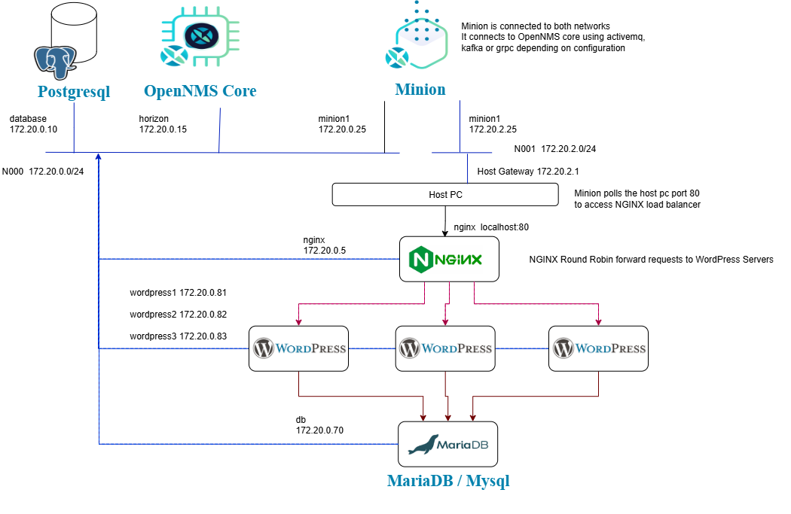

[Main Menu](../README.md) | [Session 2](../session2/README.md) | [Exercise-2-service-monitoring](../session1/Exercise2-service-monitoring1.md)

# Exercise Service Monitoring

## service 3 tier network

Often sites are made scalable through load-balancing a number of servers. 
In this example we have installed three wordpress servers behind an NGINX load balancer.

All there server share the same MariaDB database which also maintains the session data across the servers.



## running the example

```
cd minimal-minion-activemq
docker compose up -d
```


