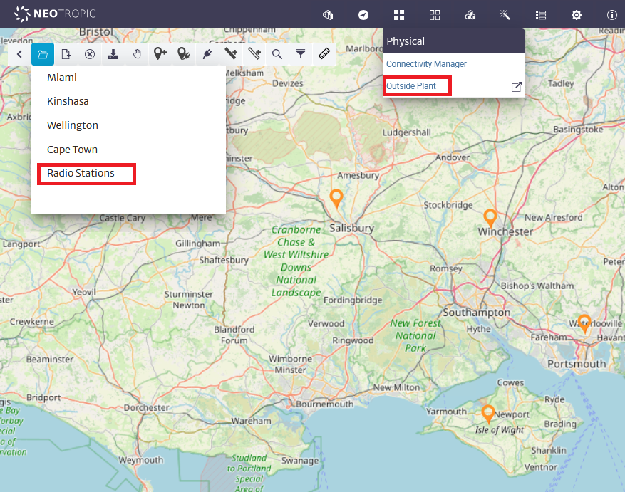

# Broadcast Radio Network Management Example

> **Note**  
> A video demonstrating this project is available at https://youtu.be/KAJs3QmSp4A

This example shows how Kuwaiba and OpenNMS can be used to model and manage a broadcast radio network.

* [Kuwaiba](https://www.kuwaiba.org/) is an open source Service Provider Inventory solution
* [OpenNMS](https://github.com/OpenNMS/opennms) is an open source enterprise grade network management platform.

<table>
  <tr>
    <td></td>
    <td>
     
      
     
    </td>
  </tr>
</table>

## Contents

[docs](./docs) Case Study: Broadcast Radio Management using OpenNMS and Kuwaiba. Contains detailed documentation on the project.

[kuwaiba-docker-compose-radio](./kuwaiba-docker-compose-radio) Contains a docker compose project for running the example.

[report-scripts](./report-scripts) Kuwaiba report scripts used in the project.

[radio-mibs](./radio-mibs) Radio Manufacturer MIB files, snmpsim simulator files and OpenNMS compiled MIBs for each device.
(These are also copied into the OpenNMS horizon configuration in the docker compose project).

