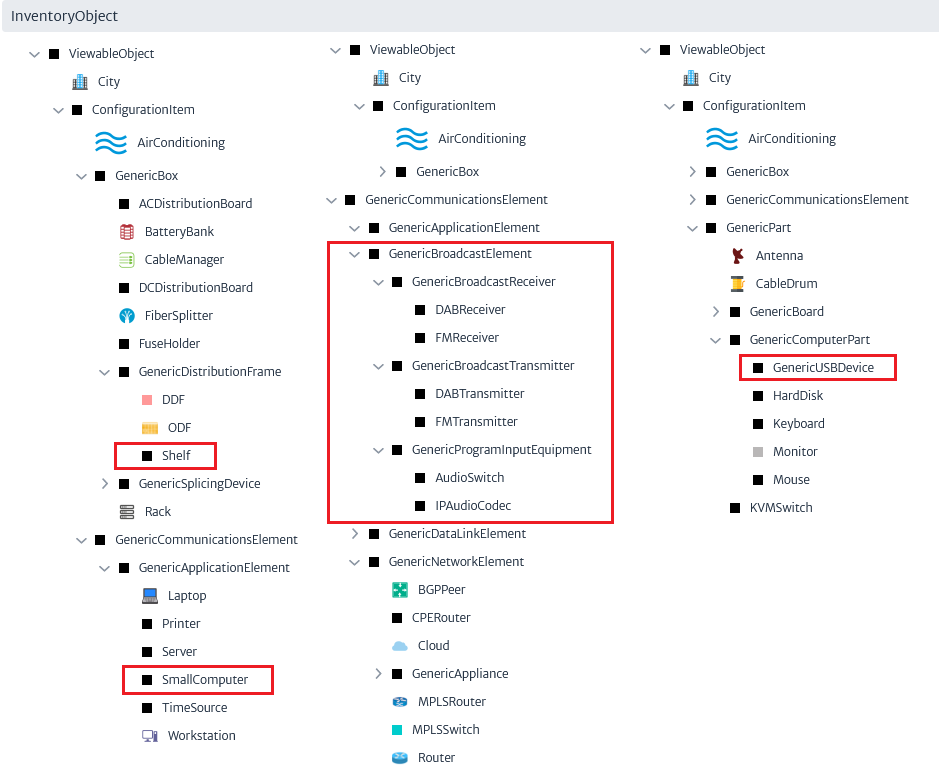
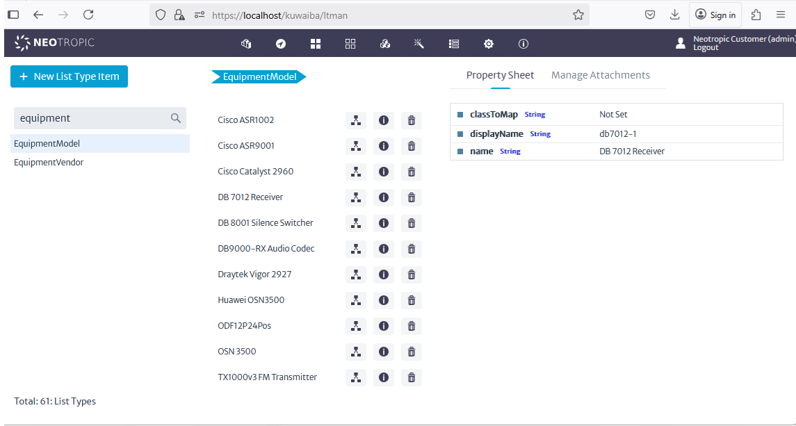
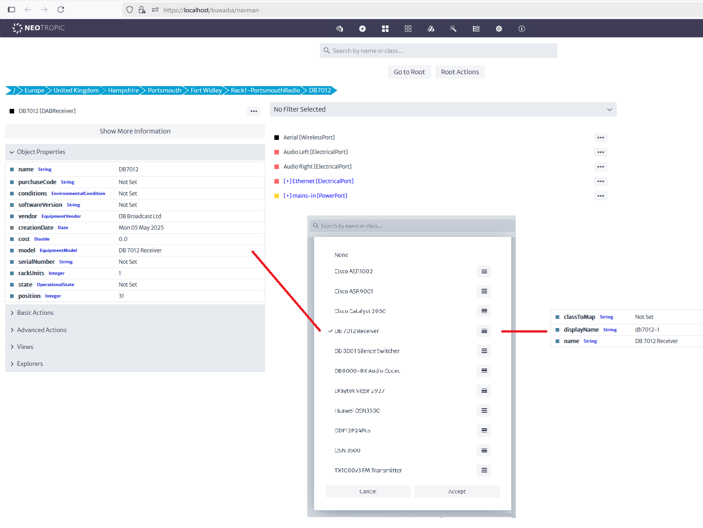
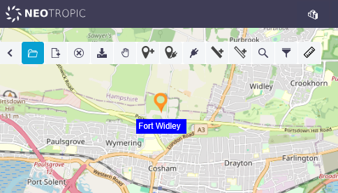
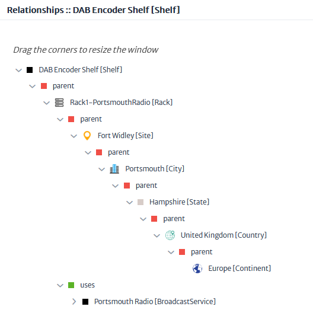
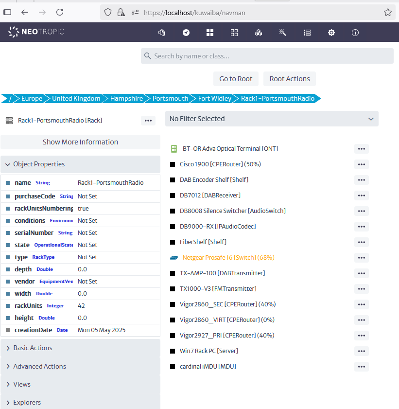
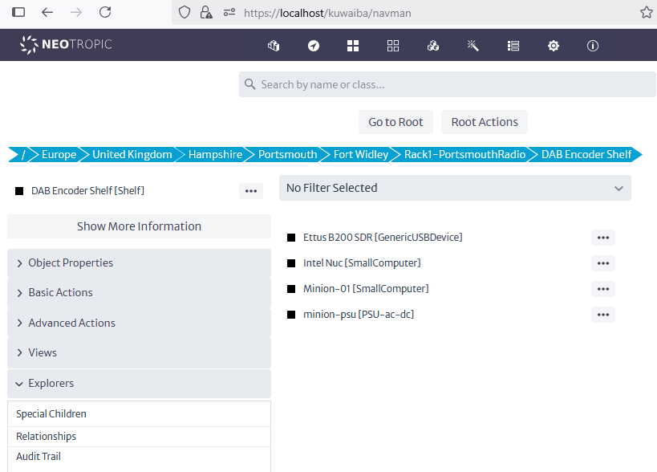
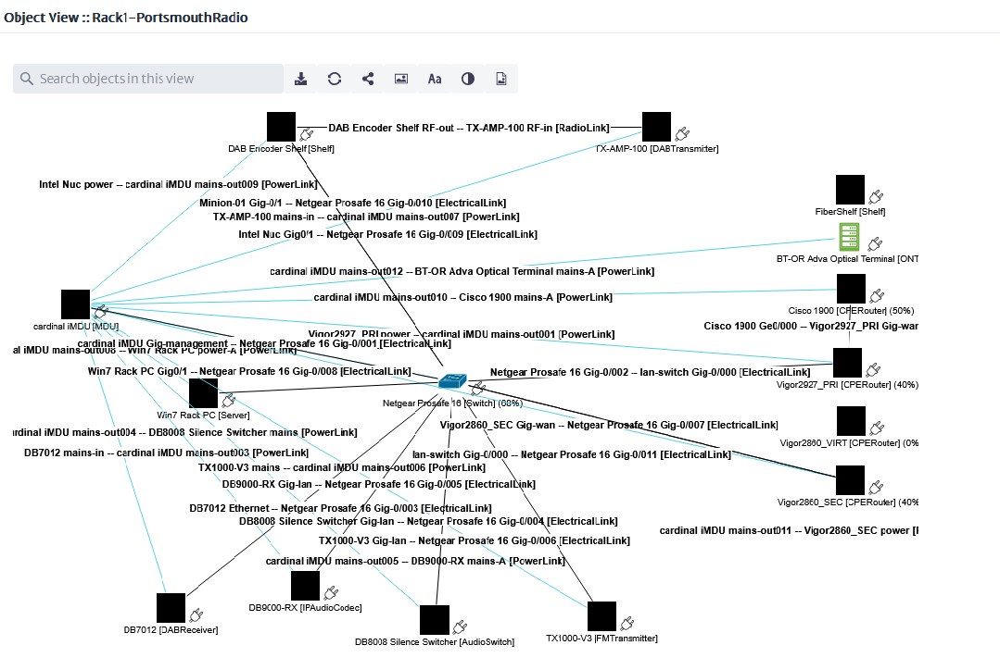
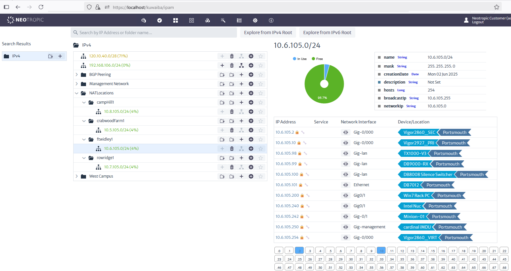
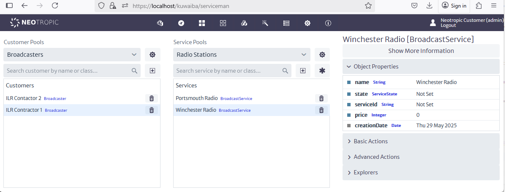

# Modelling a Radio Network in Kuwaiba

[Main Menu](../README.md) | [Radio Modelling](../docs/README.md) | [Kuwaiba Radio Model](../docs/kuwaibaRadioModel.md)

## Introduction

This section will discuss how the standard data model shipped with the Kuwaiba 2.1.1 container was extended to more usefully model the Broadcast radio network.
The object of this exercise was to understand and reuse as much of the existing model and the Kuwaiba modelling capabilities as possible before making any minimal changes.
This demonstrates modelling a radio network which can data fill OpenNMS but the same model would probably not suit other network topologies without rethinking the containment hierarchy. 

The Kuwaiba system has the capability to support sophisticated models but the model shipped with the system is quite simple and only for demonstration purposes.
I am told that the usual practice with new Kuwaiba deployments is to work with the new user to design a bespoke data model which matches best the users operations.
This is pragmatic but probably restricts reuse and more importantly open source sharing of similar data models across users.
The Kuwaiba UI support most modelling activites and allows hte model to be viewed or reported on from differnt angles. 
However it is difficult to navigate and contains too many options for the average user. 
I am told that it practice the standard UI used as an administration tool and bespoke user UI is created better matching the model and processes of each operator.
 
It would, I believe be a useful future exercise to try an create a more comprehensive and coherent base model which aligns more closely with the industry models such as the DMTF CIM or TMForum SID. 
While more complicated at the start, this would make integration, with other standards conformant systems, model alignment and reuse and user training much simpler going forwards.


## Data Model Extensions

As far as possible the supplied data model was used however the diagram highlights where extensions were created.

More general changes were added including `Shelf`, `GenericSmallComputer` ( A single board computer such as a Raspberry PI or Intel Nuc) and `GenericUSBDvice`.
Changes were also made to the containment hierarchy such as allowing a `Rack` to contain `Shelf` which can then hold small computers or other devices devices.

A `CPERouter` is provided to model a small office edge router.
Broadcast Radio specific devices are also added to model program input equipment and transmitters and receivers.



### Equipment Modelling

Each equipment type is Modelled as an instance of one of the `GenericCommunicationsElement` types described above.

The List Type Manager is used to add Manufacturers Equipment Types specific to this model.
The important field to set is the `display name` field which will later be used to choose which page template is used for this equipment in Grafana.



The full equipment model for a DB7012 device is shown below.
The equipment's ports are modelled and the model is set to the appropriate equipment type.



## Physical Network Modelling

In this model we have modelled 4 hypothetical radio sites having the same arrangements of equipment. 


### Outside Plant View

The physical location of each station is modelled by including radio sites in an outside plant view.


If you zoom in to a site, you can see a site's name and right clicking allows navigation to its model.



### Equipment Rack Modelling

The diagram below shows the containment relationships used for each radio site.

The equipment for each radio station is contained in a single rack.
If there are more than one station on a site, additional racks would be used, one for each station.



The rack modelling is shown below and the Kuwaiba view of the rack is shown on the [Radio Modelling](../docs/README.md) page.



Some of the separate components in a rack may be further contained in a shelf.



### Electrical connections

The ports on each equipment and the electrical connections between equipment ports are modelled for power, Ethernet, Analogue Audio and RF signals.
THis is shown in the somewhat busy Rack Object diagram below.

( PLEASE NOTE only the Portsmouth/Fort Widley site has all of it's wiring modelled as an example. 
The other sites simply place devices in racks and attach relevant IP addresses to device ports).



### IP Address Modelling IPAM

Each radio site in this managed network is behind a NAT router and has an overlapping address space with other sites (192.168.105.x/24).
Unfortunately, Kuwaiba has no way to represent this NAT network segmentation in the current IPAM manager.

As a work around, each site is represented as a /24 address space within an overall /22 private subnet. 
Each site is also placed in a folder representing the `location` of the site (OpenNMS can represent overlapping address spaces by using the monitoring `location` as a name space as well as IP address.

Ports on devices within each sight are associated with the relavant address in the IPAM manager as is shown below for the Fort Widley site.



## Service modelling

This example uses a very simple service model.

A Broadcasting customer pool is added with two customers `ILR Contractor1`, `ILR Contractor2`, `ILR Contractor3`.

Each Broadcast Customer has a pool of `Radio Station` services.

```
Class Name:
BroadcastService
Containment Path
: Radio Stations [Pool of GenericService]: ILR Contractor 1 [Broadcaster]: Broadcasters [Pool of GenericCustomer]
```

In this model, all of the equipment in a given rack are delivering the same radio service (DAB and FM).
So any alarms detected on one of the devices in the rack will be affecting that particular service.

This service data can be used to create metadata which helps annotate Grafana displays. 
This means that only devices related to a certain customer service will be displayed on a given Grafana page.




