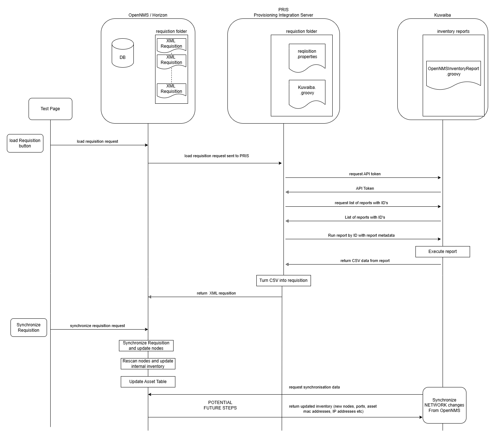
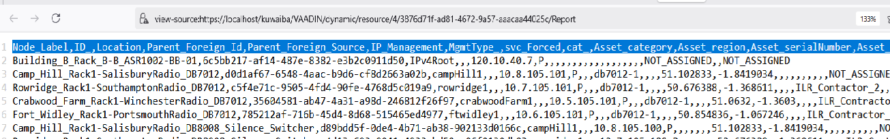
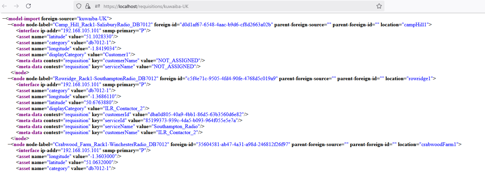
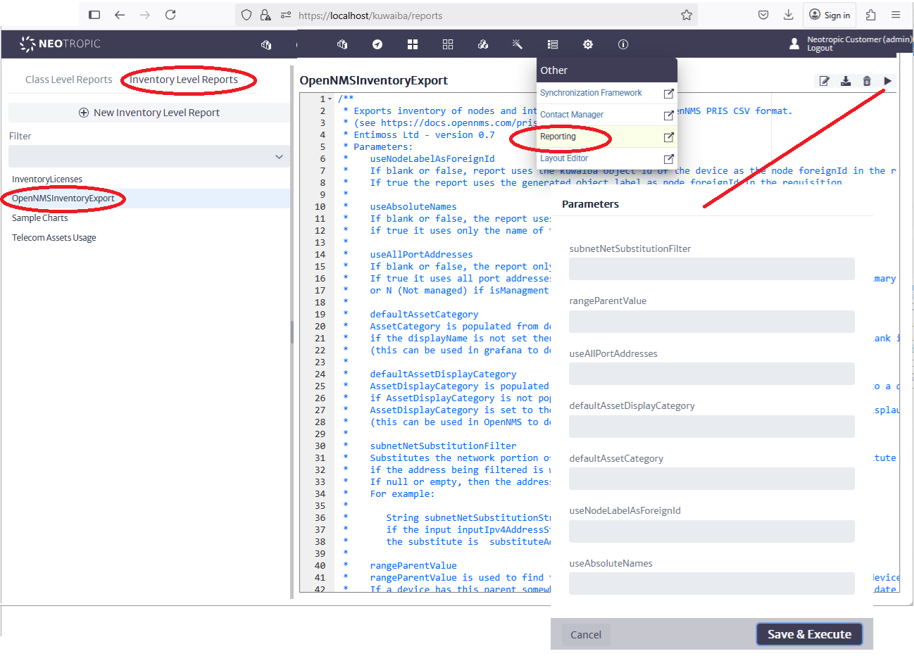

# Kuwaiba OpenNMS Integration 

[Main Menu](../README.md) | [Radio Modelling](../docs/README.md) | [Kuwaiba OpenNMS Integration](../docs/opennmsKuwaibaIntegration.md

## Introduction

This section describes the initial integration between OpenNMS and Kuwaiba. 
Full details of running the simulation are provided in the [accompanying docker compose project](../kuwaiba-docker-compose-radio).

The primary mechanism for provisioning OpenNMS is an XML `provisioning requisition` which is explained under [Opennms Documentation Provisioning](https://docs.opennms.com/meridian/2022/operation/provisioning/introduction.html).
A requisition can provide all of the data for managing a node or a seed from which OpenNMS scans each node and discovers additional interfaces, services and other SNMP information.

A requisition represents the desired future state of the OpenNMS system.
Once it is created, a requisition must be `synchronized` with the database. 
The synchronisation process matches the requisition contents with any nodes already in the database and adds or removes nodes or services from the OpenNMS monitoring schedule.

Requisitions are also referred to as `foreign sources`.
All nodes in the OpennMS system are uniquely identified by their `foreign source` and `foreign id`.

Requisitions can be created and viewed in the OpenNMS Administration UI.

The [OpenNMS ReST provisioning API](https://docs.opennms.com/meridian/2024/development/rest/requisitions.html) can also perform CRUD actions on requisitions. 

OpenNMS can also be told to import a requisition from a foreign URL using a provisioning event which is injected using the ReST API.
This is the mechanism used to interact with PRIS.

The following timing diagram shows the interactions between the various components in the Kuwaiba / OpenNMS integration.

## PRIS

The [Provisioning Integration Server](https://docs.opennms.com/pris/2.1.0/index.html) is a tool to help integrate OpenNMS with external CMDB or inventory systems.

In this integration, a rest call is made to OpenNMS which causes it to request a requisition from PRIS. 
Each requisition definition is in a different folder in PRIS, and the URL call determines which folder is examined to find a script to interact with the external CMDB.

The Kuwaiba requisition definition consists of a `requisition.properties` file and a `kuwaiba.groovy` script which contains a client to interact with Kuwaiba using its ReST API.

PRIS makes a ReST call to Kuwaiba to run a named inventory report. 
The Inventory report must return a CSV file with columns corresponding to the [ CSV import definition](https://docs.opennms.com/pris/2.1.0/sources/csv.html)
and [Asset Field Mapping](https://docs.opennms.com/pris/2.1.0/mapper/asset-fields.html)

PRIS turns the CSV returned from Kuwaiba

into an XML Requistion

## Kuwaiba

An `OpenNMSInventoryImport.groovy` script is provided to generate a CSV file suitable for PRIS.
Using a Kuwaiba report script means tht we can in future create different reports to do differnt mappings if the model changes or other mappings would be more approprriate.

The report can be run manually in the Kuwaiba UI to return a CSV output to the browser as show below or it can be run using the Kuwaiba API which is the mechanism used by PRIS.

The Report has several properties which control report generation.

| Parameters | description |
|:-----------|:-----------|
|useNodeLabelAsForeignId | If blank or false, report uses the kuwaiba object id of the device as the node foreignId in the requisition (default)  If true the report uses the generated object label as node foreignId in the requisition. |
| useAbsoluteNames  |  If blank or false, the report uses parent location and rack to generate each node name. if true it uses only the name of the node given in the model  |
|  useAllPortAddresses  |  If blank or false, the report only uses ports designated as isManagement. (default) If true it uses all port addresses assigned to a device and designates the interface snmp-primary P (primary snmp) if isManagment is true or N (Not managed) if isManagment is false  |
| defaultAssetCategory  |  AssetCategory is populated from device EquipmentModel displayName if the displayName is not set then the AssetCategory is set to the defaultAssetCategory or blank if the defaultAssetCategory is not set (this can be used in grafana to determine which display template to use)  |
| defaultAssetDisplayCategory  |  AssetDisplayCategory is populated from the customer name associated with a service attached to a device or a parent rack in the model. if AssetDisplayCategory is not populated from the model, a default value can be used. AssetDisplayCategory is set to the defaultAssetDisplayCategory or blank if the defaultAssetDisplauCategory is not set (this can be used in OpenNMS to determine which users can view an object)  |
|    subnetNetSubstitutionFilter  |  Substitutes the network portion of the inputIpv4Address for the network portion of the substitute address if the address being filtered is within the within subnet range. If null or empty, then the address is passed through unchanged. For example: &nbsp;&nbsp;&nbsp;&nbsp;&nbsp;&nbsp;&nbsp;&nbsp;&nbsp;&nbsp;&nbsp;&nbsp;&nbsp;&nbsp;&nbsp;&nbsp;&nbsp;&nbsp;&nbsp;&nbsp;&nbsp;&nbsp;&nbsp;&nbsp;&nbsp;&nbsp;&nbsp;&nbsp; &lt;within subnet&gt;=&lt;substitute subnet&gt;    String subnetNetSubstitutionStr = "172.16.0.0/22=192.168.105.0/24"    if the input inputIpv4AddressStr = "172.16.105.20"    the substitute is  substituteAddressStr= "192.168.105.20  |
| rangeParentValue | rangeParentValue is used to find the parent visible object of the devices to include in the device list. If a device has this parent somewhere in their parent object tree, the device will be a candidate to be included in the requisition for OpenNMS. The rangeParentValue can be the name property of the object or the kuwaiba objectID of the object. If the rangeParentValue is not set or is empty, all devices will be included in the tree. If the rangeParentValue is not found, an exception will be thrown and the report will not complete.  |

If the Kuwaiba API is used, PRIS must first request an access token and then use that token for all other actions. 

Reports are numbered depending on their order of provisioning, so PRIS selects the report number from a retrieved list of reports and then uses that number in the execute request. 

PRIS also injects external report parameters into the execute request.
The properties are set in the `requisition.properties` file for each requisition definition.

